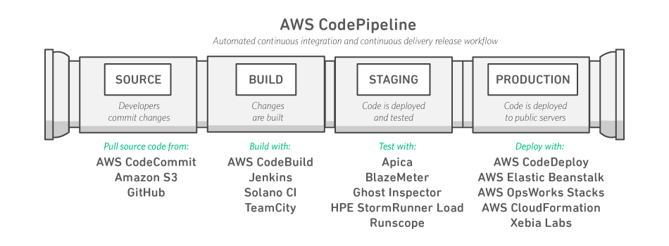
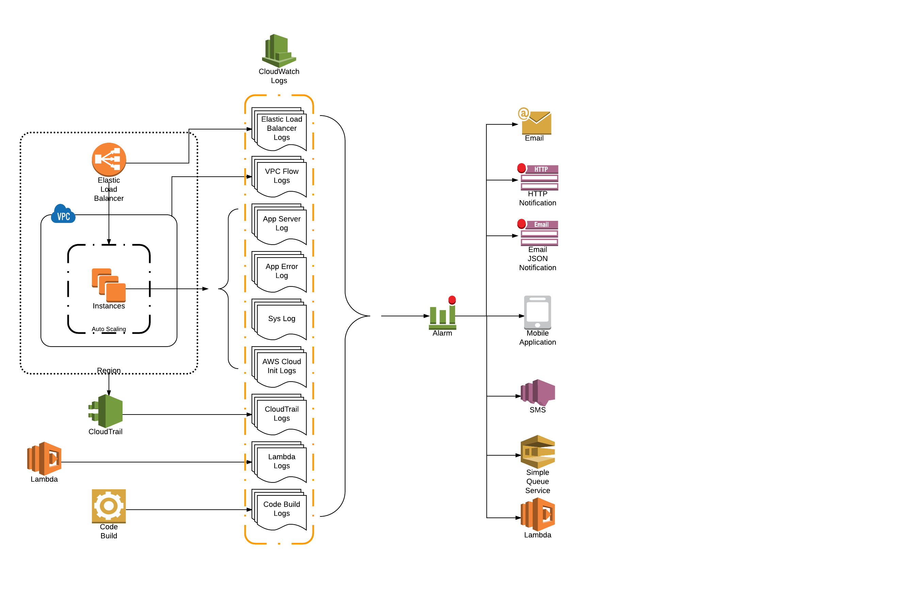
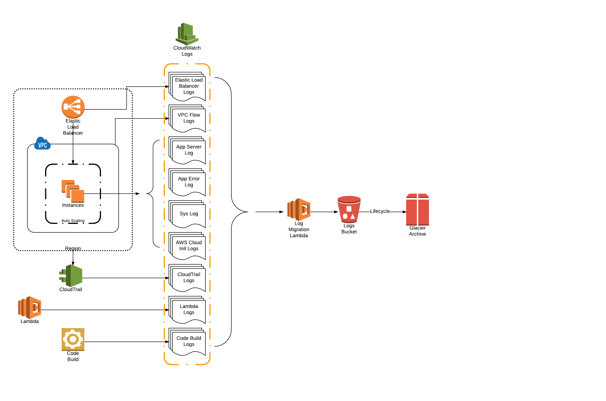
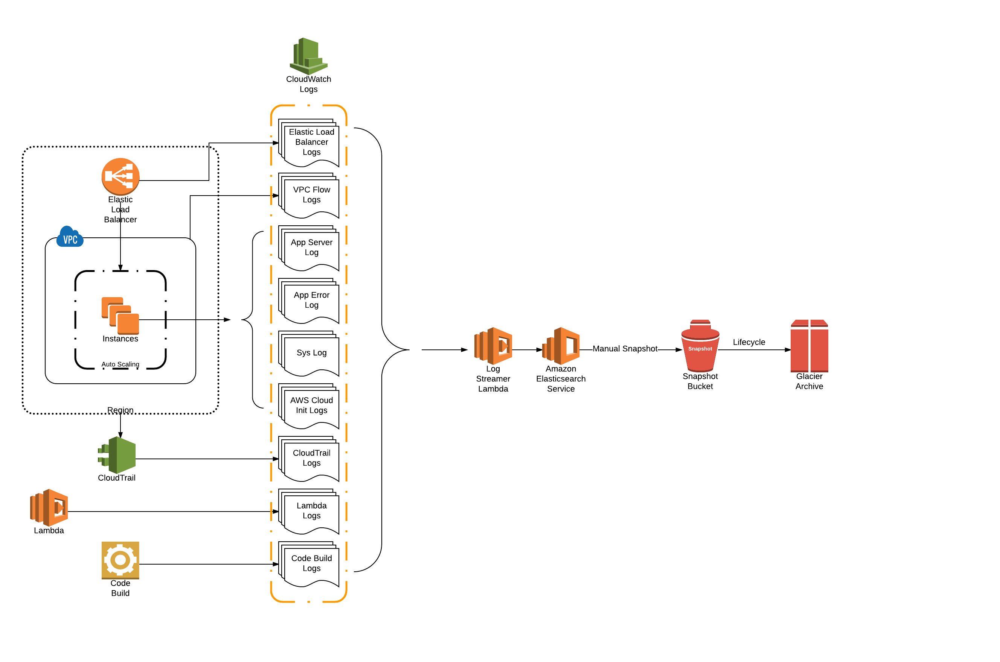
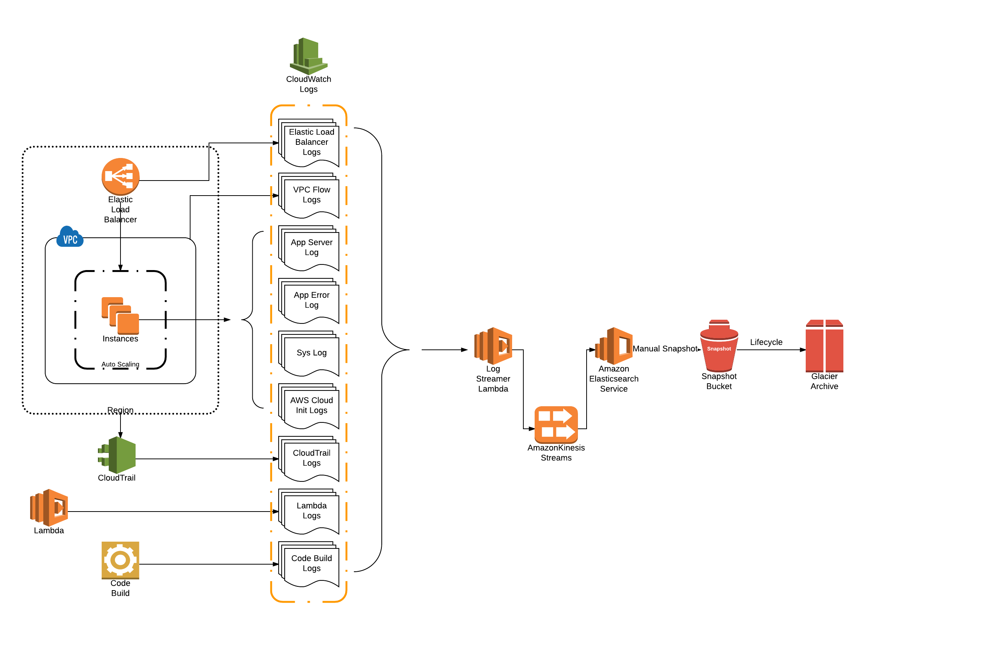
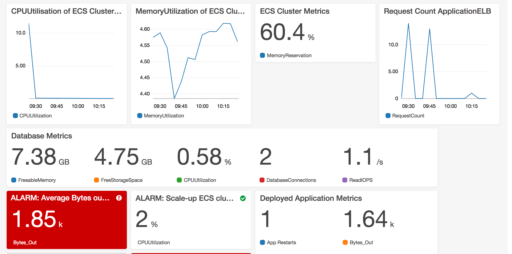

- [Automation Logic Cloud Platform](#automation-logic-cloud-platform)
  - [How to run](#how-to-run)
    - [Prerequisites](#prerequisites)
    - [Quick Start Steps](#quick-start-steps)
    - [Parameters Conditions Explained](#parameters-conditions-explained)
      - [__mastertemplate.yaml (service stack)__](#mastertemplateyaml-service-stack)
        - [Debug Mode](#debug-mode)
      - [__portfolio/cloudplatform/ubuntu/node-sql/cloudplatform.yaml (product stack)__](#portfoliocloudplatformubuntunode-sqlcloudplatformyaml-product-stack)
        - [Resource Prefix](#resource-prefix)
        - [Domain Name](#domain-name)
        - [Database Configuration](#database-configuration)
        - [Application Settings](#application-settings)
        - [Auto-Scaling Web Server Group's Instance Configuration](#auto-scaling-web-server-groups-instance-configuration)
        - [Security](#security)
        - [Notification](#notification)
        - [Logging](#logging)
        - [Debug Mode](#debug-mode)
      - [__portfolio/central-logging/central-logging-elasticsearch.yaml (product stack)__](#portfoliocentral-loggingcentral-logging-elasticsearchyaml-product-stack)
        - [Resource Prefix](#resource-prefix)
        - [CloudTrail](#cloudtrail)
        - [Elastic Search](#elastic-search)
        - [Debug Mode](#debug-mode)
  - [Description of Operation](#description-of-operation)
    - [Service Catalogue](#service-catalogue)
    - [Cloud Platform](#cloud-platform)
      - [CI / CD Pipeline](#ci-cd-pipeline)
      - [Secrets and Config Management](#secrets-and-config-management)
      - [Logging, Metrics and Monitoring](#logging-metrics-and-monitoring)
        - [Log Groups and Alarms](#log-groups-and-alarms)
        - [Log Retention](#log-retention)
        - [Elastic Search Logging](#elastic-search-logging)
        - [DASHBOARD](#dashboard)
          - [CLOUDWATCH](#cloudwatch)
          - [KIBANA](#kibana)
  - [Description of files](#description-of-files)
    - [portfolio/](#portfolio)
      - [central-logging/](#central-logging)
      - [cloudplatform/ubuntu/node-sql/](#cloudplatformubuntunode-sql)
    - [servicecatalogue/lambda](#servicecataloguelambda)
  - [Advanced Operations](#advanced-operations)
    - [Launch the stack](#launch-the-stack)
      - [Manual creation](#manual-creation)
    - [Manual delete](#manual-delete)
  - [Contributing](#contributing)

# Automation Logic Cloud Platform

This project is a modular cloud platform framework which is built on top of AWS services to provide a single-click, out of the box solution for running applications on the cloud in a secure, consistent and easy to manage manner. This cloud platform has been built based on Automation Logic's experience of creating and managing 55+ bespoke cloud platforms for our various clients.

The objective of this project is to provide a one-click solution for organizations and developers who need to focus on the application and worry less about creating and managing the infrastructure of the platform, while simultaneously providing flexibility and customizability for more experienced dev-ops users.

The ALCP (Automation Logic Cloud Platform) implements best practices in cloud automation and agile software development and is meant to provide a stable and yet easily customizable solution for organizations seeking a quick starting point to deploy their applications to the cloud.

The ALCP currently supports AWS as a cloud provider with an Azure specific version currently under development.

This repository contains several simple CRUD applications written in a variety of different languages and all their associated configurations. These sample application stacks can be deployed from the AWS service catalog once the master template has been provisioned.

Each application stack will create a templated infrastructure with autoscaling instances or containers, load balancing, security, logging, metrics, monitoring and a continuous integration / continuous deployment (CI/CD) pipeline. Once the application code is pushed to the repository, the pipeline should build and deploy the web application automatically.

This project is released under the [Apache License](https://www.apache.org/licenses/LICENSE-2.0).

## How to run

To be able to deploy this you need an AWS account.
You can use the [AWS User Interface](https://console.aws.amazon.com/console/home) to deploy the code as well as the [CLI](https://aws.amazon.com/cli/).

### Prerequisites

There are 9 regions supporting all the resources required to create the stack:

 * Virginia: **us-east-1**
 * Ohio: **us-east-2**
 * Oregon: **us-west-2**
 * Montreal: **ca-central-1**
 * Ireland: **eu-west-1**
 * London: **eu-west-2**
 * Frankfurt: **eu-central-1**
 * Sydney: **ap-southeast-2**
 * Tokyo: **ap-northeast-1**

Unsupported Regions and Missing Resources on AWS
* Northern California - Service Catalog 
* Sao Paulo - Glacier, Service Catalog, Code Build
* Singapore - Glacier
* Seoul - Service Catalog, Code Build
* Mumbai  - Service Catalog, Code Build

If you intend on using the [AWS CLI](https://aws.amazon.com/cli/) you must configure the following:

 * AWS IAM user within product development account
 * AWS CLI installed
 * AWS credentials configured

If you intend to use git to push some code to AWS CodeCommit, please follow the instructions on this [page](http://docs.aws.amazon.com/codecommit/latest/userguide/setting-up-ssh-unixes.html?icmpid=docs_acc_console_connect)

### Quick Start Steps

The following steps need to be run in order to get the demo to work;

1.  Launch the mastertemplate.yaml template.  
    This can be done by one of the following methods:
      - Loading mastertemplate.yaml in the [AWS Cloudformation Interface](https://eu-west-1.console.aws.amazon.com/cloudformation/) in one of the above regions, with the default parameters.
      
           Click the following button to do this automatically (launches in the eu-west-1 'Ireland' region)  
      [](https://console.aws.amazon.com/cloudformation/home#/stacks/new?region=eu-west-1&stackName=service-stack&templateURL=https://s3.amazonaws.com/al-cf-templates-us-east-1/templates/mastertemplate.yaml)

      - Using the AWS CLI to create a stack.  
        ```
        aws cloudformation deploy --region "eu-west-1" --template-file "mastertemplate.yaml" --stack-name "service-stack" --capabilities "CAPABILITY_NAMED_IAM" --parameter-overrides Cleanup="Enable"
        ```


2. The stack creates an [AWS CodeCommit](https://aws.amazon.com/codecommit/) repository as part of the infrastructure, you must push the files from this repository to it. This will run the CI/CD pipeline for the master stack and provision the service catalog with the demo products.

      - First you need to get your git repo URL (from CodeCommit) to push your code. You can go to AWS CodeCommit UI or use the AWS CLI:

        ```
        GIT_REMOTE=$(aws cloudformation describe-stacks --region "eu-west-1" --stack-name "service-stack"  --query "Stacks[].Outputs[?OutputKey=='RepoURL'].OutputValue"  --output text)
        ```

      - Then add a new remote repository to your git and push the code

        ```
        git remote add codecommit ${GIT_REMOTE};     
        git push codecommit master
        ```

3. Open the [AWS Service Catalog web interface](https://console.aws.amazon.com/servicecatalog/home?#/dashboard) on the AWS Console and select a demo product and launch it.
    -  You will need to select your EC2 SSH Key in the KeyName parameter. This needs to be created from the [AWS EC2 web interface](https://console.aws.amazon.com/ec2/v2/home?#KeyPairs:sort=keyName) if you don't have one already.
    -  You will need to provide a database username & password which will be created during stack creation.
    -  Each demo listed as the products in the service catalog will launch a different application using the standardized infrastructure of the ALCP with some minor application specific changes.
    -  **Note:** If no products are listed after running the steps above, you may need to add yourself to the appropriate user group that the product is shared on. These details can be found in the *portfolio/mappings.yaml* file.    

4. The stack creates an AWS CodeCommit repository as part of the infrastructure, you must push the files from this repository to it. This will run the CI/CD pipeline for the product stack and provision the demo web application for that product in a few minutes.

      - First you need to get your git repo URL (from CodeCommit) to push your code. You can go to AWS CodeCommit UI or use the AWS CLI:

        ```
        GIT_REMOTE=$(aws cloudformation describe-stacks --region "eu-west-1" --stack-name "presentation"  --query "Stacks[].Outputs[?OutputKey=='RepoURL'].OutputValue"  --output text)
        ```

      - Then add a new remote repository to your git and push the code

        ```
        git remote add codecommit ${GIT_REMOTE};
        git push codecommit master
        ```

5. When the platform / stack is no longer needed, it can be terminated from the list of provisioned products in the service catalogue.
    - If the **auto cleanup** options are enabled, the retained resources of a stack will be cleaned up automatically.
    - If **manual cleanup** is required, the *utils/cleanup/cleanup.sh* script can be used. To use run the following command from the terminal.
      ```
      PREFIX=<resource prefix> REGION=<region> ./utils/cleanup.sh
      ```

### Parameters Conditions Explained

#### __mastertemplate.yaml (service stack)__
##### Debug Mode
* Cleanup -> This option when enabled with create a cleanup lambda function and an cloudformation export of its ARN (in order for product stacks to find it). This lambda gets triggered when the product stack is deleted and takes care of deleting any retained resources from the product stack. This functionality is only to be used during testing. **NEVER ENABLE FOR PRODUCTION PLATFORMS**.


#### __portfolio/cloudplatform/ubuntu/node-sql/cloudplatform.yaml (product stack)__
The other ALCP product stacks have near identical options.
##### Resource Prefix
 * Resource Prefix -> A string which is used as the prefix for all resources created by the stack. Helps to identify stack resources. Suggested policy is:
    - use same name as the product name when provisioning through service catalogue.
    - use same name as the stack name when provisioning through cloud formation web interface.
##### Domain Name
 * Use DNS -> This option when enabled will map the Elastic Load Balancer to a subdomain in al-labs.co.uk
    - The domain name can be changed in the template to use a different domain of your choice.
##### Database Configuration
 * DBEngine -> Choice of back-end database to create when provisioning the stack.
    - Differs based on application type.
 * Database Name -> The Database Name to create.
 * Database UserName -> The Username to create on the database.
 * Database Password -> The password for the corresponding user account to create on the database.
 * Database Instance Class -> The Instance Type to use when creating the database.
 * Database Encryption -> Options for turning on database encryption.
 * Database Storage -> The maximum size of the database.
##### Application Settings
 * Application TCP Port -> The TCP port that the application will listen on.
##### Auto-Scaling Web Server Group's Instance Configuration
 * Use Spot Instances -> This option when enabled will use Spot Instances instead of On-Demand Instances. Spot Instances cost far less than On-Demand Instances and can be used in non-critical environments like development.
    - AWS will provide a 2 minute warning and then terminate the instance.It is possible to fail-over to using On-Demand Instances when this happens, but this feature has not been implemented in this platform yet.
    - **WARNING: Spot Instances can be auto terminated by AWS when the Spot Price rises above your bid price.**   
    - **UPDATE (28th July 2017):  Spot Instances work in all regions where this stack can deploy to.**  
    - All (working) regions, except Ohio, support m3.medium as the smallest acceptable spot instance type. Ohio requires m4.large.
 * Spot Instance Bid Price -> The maximum bid price for spot instance.
    - $0.02 can be the minimum set to all regions. The template has $0.05 has the default price.
 * Use Docker Containers -> Enable docker containers through ECS or Disable for EC2 VM Instances.
 * Instance Type -> Select the type of EC2 Instances to use as the web server or container host.
 * Operating System -> Choice of Operating System that will run on the web server. Some options are locked based on which demo is run.
 * Instance Count -> The Number of EC2 instances to launch during stack creation.
 * Instance Max Count -> The Maximum number of instances to auto-scale.
 * Instance Min Count -> The Minimum number of instances to auto-scale.
##### Security
 * Key Pair Name -> Select your EC2 SSH key pair which is used to secure your VMs. This needs to be created before hand from the AWS EC2 web interface.
 * Use HTTPS -> This option when enabled will create a certificate using the Amazon Certificate Manager and attach it to the Elastic Load Balancer to create a secure HTTPS connection.
 * SSH Location -> The CIDR IP Address range from which to accept SSH or RDP connections. Restrict this to your organization's static IP to prevent unauthorized admin access.
##### Notification
 * Notification Email Address -> A valid email address to which stack update and alarm notification emails are sent.
 * Approval Email Address -> A manager's email address to which Continuous Integration Pipeline sends an approval link which needs to be clicked to approve a build for deployment.
 * Slack Channel Webhook -> A Slack webhook URL which is used to send notifications to a Slack channel.
##### Logging
 * Enable Advanced Logging Features -> When Enabled, this option will create log groups to log all activity including lambda functions on the stack. When disabled only the build server and application logs are logged. 
 * Deploy Elasticsearch -> This option when enabled will stream logs to an Elastic Search instance.
    - Central -> Requires a central logging product to be provisioned beforehand in the same region. This will create a central Elasticsearch cluster.
    - Integrated -> Each stack will create and manage its own Elasticsearch cluster.
 * Central Logging Elasticsearch Stack's Resource Prefix Name -> The resource prefix name of the central logging stack. Used to find the central ES cluster if the previous option is set to Central
 * Amazon ES cluster size -> The size of the Elastic Search cluster to create if Deploy Elasticsearch is set to Integrated.
    - Large : 6 x r3.8xlarge.elasticsearch
    - Medium : 4 x r3.2xlarge.elasticsearch
    - Small : 2 x m3.large.elasticsearch
    - Tiny : 2 x t2.medium.elasticsearch (default)
 * IP address range -> The IP range that can access an Integrated Elasticsearch cluster.
##### Debug Mode
 * Auto Cleanup Stack -> When Enabled, on stack deletion, the stack will signal the cleanup lambda, on the Service Stack, which is used to delete retained resources of this stack. This feature is only meant to make testing easier and as such is NOT RECOMMENDED FOR PRODUCTION.
 
#### __portfolio/central-logging/central-logging-elasticsearch.yaml (product stack)__
##### Resource Prefix
 * Resource Prefix -> A string which is used as the prefix for all resources created by the stack. Helps to identify stack resources. Suggested policy is:
    - use same name as the product name when provisioning through service catalogue.
    - use same name as the stack name when provisioning through cloud formation web interface.
##### CloudTrail
 * CloudTrailLogging -> Option to enable Cloud Trail logging in the region.
##### Elastic Search
 * Amazon ES cluster size -> The size of the Elastic Search cluster to create if Deploy Elasticsearch is set to Integrated.
    - Large : 6 x r3.8xlarge.elasticsearch
    - Medium : 4 x r3.2xlarge.elasticsearch
    - Small : 2 x m3.large.elasticsearch
    - Tiny : 2 x t2.medium.elasticsearch (default)
 * IP address range -> The IP range that can access an Integrated Elasticsearch cluster.
##### Debug Mode
 * Auto Cleanup Stack -> When Enabled, on stack deletion, the stack will signal the cleanup lambda, on the Service Stack, which is used to delete retained resources of this stack. This feature is only meant to make testing easier and as such is NOT RECOMMENDED FOR PRODUCTION.


## Description of Operation

### Service Catalogue

[AWS Service Catalog](https://aws.amazon.com/servicecatalog/) allows organizations to create and manage catalogs of IT services that are approved for use on AWS. These IT services can include everything from virtual machine images, servers, software, and databases to complete multi-tier application architectures. AWS Service Catalog allows you to centrally manage commonly deployed IT services, and helps you achieve consistent governance and meet your compliance requirements, while enabling users to quickly deploy only the approved IT services they need. 

The project utilizes the AWS Service Catalog to create and manage a list of products which are created dynamically. There is a CI/CD pipeline setup which allows the template author to instantly deploy his changes to the service catalog and thereby allow users to provision the products.

The products that are being deployed from the service catalog are primarily the cloud platform with support for different application types. A different application type or database type can easily be assembled from the base infrastructure with minimal effort and and new application integrated.


An administrator or template author can add stacks to the product portfolio by committing them to the source control repository where they are then automatically built and deployed to the service catalogue.

Developers and administrators are then able to select products to build from the service catalogue.  Roles and privileges can be used to constrain users to specific products, and to specific parameters when building products, such as resource limits and access to data.

### Cloud Platform

The Automation Logic Cloud Platform (ALCP) will automate the creation of a cloud platform architecture with modular sub-systems which can support any application code that needs to be run on the platform.
The objective of this project is to provide a one-click solution for organizations and developers who need to focus on the application and worry less about creating and managing the infrastructure of the platform, while simultaneously providing flexibility and customizability for more experienced dev-ops users.

The core of the platform is the networking infrastructure, the database and the auto-scaling web servers. This is complemented by three separate sub-systems namely

 * The CI / CD Pipeline Sub-System
 * The Secrets and Configuration Management Sub-System
 * The Logging, Metrics and Monitoring Sub-System

Each of the above sub-systems can be removed, modified, supplemented or replaced based on specific requirements. Users of the ALCP are provided the liberty to perform these alterations themselves or Automation Logic can perform the required changes on a time and materials basis.

There are several similar products or stacks available to choose from in this project. Each of these has minor variations to support different common application and database types. This also additionally demonstrates the flexibility of the ALCP, that adding support for other applications or databases should be trivial.

A sample reference architecture is outlined in the below diagram.

*Note: This architecture may be different based on the specific architecture chosen and based on other parameters chosen prior to deploying the product.*


#### CI / CD Pipeline

The CI / CD pipeline sub-system is made up of four main components.

 * [AWS CodeCommit](https://aws.amazon.com/codecommit/) -> Is an easily replaceable GIT repository which can be swapped out for [GitHub](https://github.com/).  
 * [AWS CodeBuild](https://aws.amazon.com/codebuild/details/) -> Is an on-demand build server. Can be replaced with [Jenkins](https://jenkins.io/) or other tools.  
 * [AWS CodeDeploy](https://aws.amazon.com/codedeploy/) -> A deployment agent to deploy code to the Instances or Virtual Machines. Can be replaced with Jenkins or other tools.  
 * [AWS CodePipeline](https://aws.amazon.com/codepipeline/) -> A pipeline that synchronizes and triggers the other three components. Can be replaced with Jenkins or other tools.

This sub-system is modular and can be replaced entirely or have parts of it replaced by other 3rd party tools such as Jenkins.

The developers who use the platform can be given access to commit their code to the repository (CodeCommit or GitHub).

Once a new commit is detected in the *Master* branch the CodePipeline will notify the build server to pull the latest changes and initiate a build.

The build instructions are coded in a **buildspec.yml** file which is either a standalone file in the repository or is inline within the product template. 
This project uses inline buildspec files in the product template.

We use CodeBuild to not only build the artifact, we also use it to run **Unit Tests** and **Integration Tests**.

Once all tests have passed, the CodePipeline initiates the deployment using CodeDeploy. The CodeDeploy agent is an agent which is installed on the server during server launch, it is triggered to pull down the built artifact and executes the deployment instructions which are provided in an **appspec.yml** file which is present in the root directory of the artifact.

There is also a manual approval step which can be added to prevent continuous deployment while still performing continuous integration. An approver with sufficient privileges needs to approve each build before its deployed in this case. This project includes the manual approval step however it is at the very end of the pipeline after deployment and as such is for demo purposes only, and does not prevent continuous deployments.

*Note: [ECS](https://aws.amazon.com/ecs/) deployment is currently not supported by [AWS CodeDeploy](https://aws.amazon.com/codedeploy/). In this project we use [AWS Cloudformation](https://aws.amazon.com/cloudformation/) to deploy ECS / Docker containers.*

AWS CI / CD pipeline example is outlined in the below diagram.



#### Secrets and Config Management

The secrets and config management sub-system relies on [AWS Parameter Store](https://aws.amazon.com/ec2/systems-manager/parameter-store/) to store configuration values and secrets. The secrets are encrypted using an [AWS KMS](https://aws.amazon.com/kms/) key which can encrypt and decrypt the values. [AWS IAM](https://aws.amazon.com/iam/) is used to provide fine granularity access control over which users or services can encrypt and which users and services can decrypt the values in the Parameter Store.

[AWS Parameter Store](https://aws.amazon.com/ec2/systems-manager/parameter-store/) can store three types of values;

  - String -> A string value
  - StringList -> A collection of strings
  - SecureString -> A string which is encrypted with a [AWS KMS](https://aws.amazon.com/kms/) Key

Since [AWS Cloudformation](https://aws.amazon.com/cloudformation/) does not provide support for storing SecureStrings, we use a custom **parameter store [AWS Lambda](https://aws.amazon.com/lambda/) function** to store secret SecureStrings in the AWS Parameter Store. This lambda function has only the privileges to use the KMS key for encrypting a value and not decrypting it. This process is seamless and carried out automatically during stack provisioning and preserves the secrets effectively.

#### Logging, Metrics and Monitoring

The logging sub-system uses [AWS CloudWatch](https://aws.amazon.com/cloudwatch/) to log everything within the cloud platform. All logs and metrics are available in near real-time frequency.
Additionally [AWS Elasticsearch Service](https://aws.amazon.com/elasticsearch-service/) can be enabled to provide additional logging capabilities.

There are two logging modes, Basic and Advanced.

  - Basic: Only the build server and application logs are logged.
  - Advanced: This will create log groups to log all activity including lambda functions on the stack.

##### Log Groups and Alarms

**Metrics**, either derived by from the logs or sent directly from the instances are also available in the CloudWatch dashboard.
There are a number of automated **Alarms** that make use of metrics to send out notifications to the administrator.
Additionally some automated recovery actions can be directly triggered by the alarms without user intervention.

The product log groups and possible alarm actions are outlined in the image below.



##### Log Retention

There is a log retention policy in place that migrates all logs to [AWS S3](https://aws.amazon.com/s3/) and gradually migrates them to long term storage such as [AWS Glacier](https://aws.amazon.com/glacier/). This is especially useful in situations where logs need to be preserved for long periods of time to meet audit or compliance requirements.

The Log migration and retention policy is outlined in the image below.



##### Elastic Search Logging

There is an additional option of using [AWS Elasticsearch Service](https://aws.amazon.com/elasticsearch-service/) in addition to the standard CloudWatch Logs.
This option when enabled by parameter will stream log data to AWS Elasticsearch where it can be queried and visualized with the [Kibana](https://www.elastic.co/products/kibana) dashboard plugin.

There are two methods of using Elasticsearch.

   - Central -> Which requires a central logging product to be provisioned, from the service catalog, beforehand, in the same region. This will create a central Elasticsearch cluster.
   - Integrated -> Each stack will create and manage its own Elasticsearch cluster.

*Note: AWS Elasticsearch is expensive. Consider leaving it disabled if not specifically required for your use-case.*

*Note: AWS Elasticsearch can be secured by restricting it to an organization's IP. However Kibana cannot be secured using [AWS IAM](https://aws.amazon.com/iam/) policies which will allow anyone within an organization to view the Kibana dashboard. This is a known problem with the AWS Managed Elasticsearch service and as such cannot be fixed within the scope of this project. If you need to restrict Kibana dashboard to specific users or groups within the organization, consider alternatives such as a [self managed Elasticsearch](https://www.elastic.co/) cluster instead of the [AWS Elasticsearch Service](https://aws.amazon.com/elasticsearch-service/).*

**Retention** of Elasticsearch cluster is achieved by a snapshot process which stores the snapshot in an AWS S3 bucket which is gradually moved into AWS Glacier for long term retention.
This uses an innovative *automated manual snapshot* process. Automatic snapshot capability is available natively with AWS Elasticsearch. However to restore to a snapshot version, the process involves emailing AWS Support who will then restore to a snapshot on the user's behalf. This process is tedious and can often cause significant delays. 

There is a *manual snapshot* capability where an Elasticsearch snapshot can be triggered with a CLI or API command. Restoring from these *manual snapshots* is trivial as it can also be triggered using a CLI or API command.
In order to provide a more robust automated snapshot capability, this project implements a custom [AWS Lambda](https://aws.amazon.com/lambda/) function which sends an API call to create a manual snapshot of Elasticsearch. This custom snapshot lambda is triggered once per day, by default, using [AWS Cloudwatch Event](http://docs.aws.amazon.com/AmazonCloudWatch/latest/events/WhatIsCloudWatchEvents.html) rules which is used as an AWS equivalent of a Cron Job.

The method of operation where the logs are collected in AWS Cloudwatch Logs before being moved to AWS Managed Elasticsearch is outlined below.
This process is completely automated and the logs are available in near real-time in both Cloudwatch and Elasticsearch.




An alternative method of streaming logs to Elasticsearch is to use [AWS Kinesis](https://aws.amazon.com/kinesis/) as a ready buffer to hold logs data for up-to the past seven days. When the logs need to be analyzed an Elasticsearch cluster can be spun up and the logs from the Kinesis stream can be ingested to provide querying capability. Once the requirement is fulfilled, the Elasticsearch cluster can be taken offline to save costs. This method will provide an method to use Elasticsearch on-demand instead of constantly being run.

This feature is not currently implemented in this project, however it can be easily added on request, based on previously shelved work.
The method of operation is outlined below.



##### DASHBOARD

###### CLOUDWATCH

All the CloudWatch logs are collated in one location and can be viewed by the automated dashboard.
The URL for the dashboard is present as a stack output.

An example dashboard can be found in the image below.



###### KIBANA

If Elasticsearch is used, the Kibana dashboard is automatically populated using a dashboard specification which is uploaded during the build pipeline.

An example Kibana dashboard can be found in the image below.


## Description of files

```
.
├── LICENSE.txt
├── README.md
├── mastertemplate.yaml
├── portfolio
│   ├── central-logging
│   │   └── central-logging-elasticsearch.yaml
│   ├── cloudplatform
│   │   └── ubuntu
│   │       └── node-sql
│   │           ├── app
│   │           │   ├── appspec.yml
│   │           │   └── containerapp.template.yaml
│   │           │   └── Dockerfile
│   │           └── cloudplatform.yaml
│   └── mappings.yaml
└── servicecatalogue
    └── lambda
        ├── lambda-cloudformation.yaml
        ├── requirements.txt
        └── sync-catalog.py
```

 * mastertemplate.yaml -> Template for _CodePipeline_ to manage a _Service Catalog_. The pipeline consists of a _CodeCommit_ repository and the steps to manage the portfolio and its products.

### portfolio/
 * mappings.yaml -> Instructions for the _CodePipeline_ defining the _Service Catalog_ portfolio and a list of products that are a part of it.

#### central-logging/
 * central-logging-elasticsearch.yaml -> A central-logging Elasticsearch cluster that exports an endpoint so infrastructure and application stacks can stream data to it.

#### cloudplatform/ubuntu/node-sql/
The other ALCP product stacks have near identical file structure.

 * cloudplatform.yaml -> Main _CloudFormation_ template for infrastructure deployment.
 * app/containerapp.template.yaml -> Used by the _CodePipeline_ defined in cloudplatform.yaml to deploy an alternative container backend for the application.
 * app/Dockerfile -> The docker file with instructions used to create the docker containers when the Use Containers option is selected.
 * app/appspec.yml -> The file with deployment instructions which is used by AWS Code Deploy to deploy changes as part of the CI/CD pipeline.

### servicecatalogue/lambda

 * lambda-cloudformation.yaml -> **CloudFormation** template to deploy a stack with the lambda code from this directory and its supporting resources.
 * requirements.txt -> Python dependencies to be packaged with lambda code.
 * sync-catalog.py -> Code of the lambda used to manage the _Service Catalog_ portfolio.


## Advanced Operations

### Launch the stack

 * You can also use a *deploy* script from *utils/* folder to create the product stack without using the service catalog.

```
STACK_NAME=<stack name> REGION=<region> ./utils/deploy.sh
```

#### Manual creation

*Note*: you need to specify your key name on parameters _KeyName_!

```
aws cloudformation deploy --region "eu-west-1" --template-file "cloudformation/cloudplatform.yaml" --stack-name "test-stack" --capabilities "CAPABILITY_NAMED_IAM" --parameter-overrides KeyName="mykey"
```

### Manual delete
To delete all the resources by hand from the demo you should execute this steps sequentially:

 1. Delete the [stack name]-Service stack. [AWS console](https://eu-west-1.console.aws.amazon.com/cloudformation/home?region=eu-west-1)
```
aws s3 rb --region "eu-west-1" s3://<stack name>-codepipeline-artifacts --force
```
 2. Delete the S3 bucket `<stack name>-codepipeline-artifacts`. [AWS console](https://console.aws.amazon.com/s3/home?region=eu-west-1)
```
aws ecr delete-repository --region "eu-west-1" --repository-name "<stack name>-myapp" --force
```
 3. Delete ECS Registry `<stack name>-myapp`. [AWS console](https://eu-west-1.console.aws.amazon.com/ecs/home?region=eu-west-1#/repositories)
```
aws cloudformation wait stack-delete-complete --region "eu-west-1" --stack-name "<stack name>-MyApp-Service"
```
 4. Delete the `<stack name>`. [AWS console](https://eu-west-1.console.aws.amazon.com/cloudformation/home?region=eu-west-1)
```
aws cloudformation delete-stack --region "eu-west-1" --stack-name <stack name>
```
 5. Delete the ACM Certificates. [AWS console](https://eu-west-1.console.aws.amazon.com/acm/home?region=eu-west-1)
```
aws acm delete-certificate --region "eu-west-1" --certificate-arn <certificate ARN>
```
 6. Delete the Log Groups from CloudWatch. [AWS console](https://eu-west-1.console.aws.amazon.com/cloudwatch/home?region=eu-west-1#logs:)
```
aws logs delete-log-group --region "eu-west-1" --log-group-name <group name>
```

## Contributing

This repo has an **.editorconfig** file so you should install EditorConfig in your code editor/IDE to maintain code style consistency.

* VS Code - https://marketplace.visualstudio.com/items?itemName=EditorConfig.EditorConfig
* Atom - https://atom.io/packages/editorconfig

You can configure locally git hooks to run the tests before commit/push and then fail the pipeline

* You need to configure your repo to use the **.githooks** folder
```
git config core.hooksPath .githooks
```
